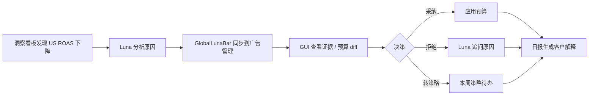
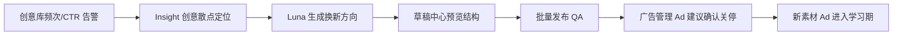
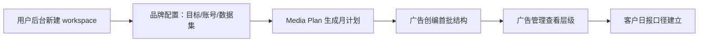

# AdsGo 2.0 产品逻辑方案 Spec

> 版本：2026-07-03 · 分支：`AdsGo2.0`  
> 范围：前端可交互原型 · 不含真实后端 / 广告平台 API / 权限系统

---

## 1. 产品定位

AdsGo 2.0 面向**效果广告优化师**与**代运营团队**，在单一工作区内完成「计划 → 执行 → 监控 → 调整 → 复盘 → 客户汇报」闭环。

**核心原则：GUI-first, Chat-assisted**

| 能力 | GUI 负责 | Luna（Chat）负责 |
|------|----------|------------------|
| 批量操作 | 筛选、多选、字段编辑、diff 确认 | — |
| 意图表达 | — | 自然语言提问、生成方案 |
| 决策解释 | 证据抽屉、原因列、趋势 | 追问人工判断、沉淀偏好 |
| 状态追踪 | 表格状态、待办、策略循环 | 同步建议到对应模块 |
| 客户交付 | 日报、报告导出 | 生成可读叙述 |

Chat 不替代 GUI；Luna 的输出必须**回显到具体功能位**，人可在 GUI 中确认、编辑、拒绝并反馈经验。

---

## 2. 用户与 Workspace

### 2.1 角色

- **优化师**：日常投放管理、预算决策、素材换新、策略执行。
- **客户成功 / 客户经理**：查看客户日报、多 workspace 切换。
- **管理员**（原型占位）：用户管理后台、客户列表、用量统计。

### 2.2 Workspace 模型

- 路径：`/workspace/:brandId/...`，默认 `default`。
- 每个 workspace 绑定一个品牌（如 `LumaFit`），共享同一套 demo 实体 ID。
- 侧边栏左上角展示品牌名；页面内不重复品牌标题。

---

## 3. 信息架构

```
Luna Chat
媒体计划与策略          → 月度计划 + 本周策略（PDCA）
数据报告与洞察          → 客户日报
广告管理               → Campaign / AdSet / Ad 三层工作台
广告创编与批量发布      → 批量发布 + 草稿中心
创意库                 → 素材库 + AI 素材生成
核心数据趋势及洞察      → 数据洞察看板
品牌配置中心           → 品牌 / 账号 / 目标 / 数据集 / Luna 配置
用户管理后台（独立布局）  → 客户列表 + 个人统计
```

所有业务页在 `WorkspaceLayout` 内渲染：Header（全局操作 + 今日待办）+ Sidebar + 内容区 + 底部 `GlobalLunaBar`。

---

## 4. 全局交互：Luna 同步机制

### 4.1 状态存储（`lunaStore`）

| 状态 | 含义 |
|------|------|
| `pendingSync` | Luna 待应用到某模块的建议包 |
| `moduleEffects` | 已应用到页面的效果（高亮行、筛选、跳转） |
| `activityLog` | Luna ↔ 系统交互轨迹 |
| `chatHistory` | 对话记录 |

### 4.2 GlobalLunaBar（底部全局条）

- **无待同步时**：展示今日异常摘要（如美国 ROAS 低于目标），可「去广告管理处理」或打开 Luna 追问。
- **有待同步时**：展示 Luna 建议摘要 +「应用到页面」，接受后写入 `moduleEffects` 并导航到目标模块。
- 各页面**不在内容区重复** Luna 横幅；统一由此全局条承载。

### 4.3 人机反馈闭环

当用户行为与 Luna 建议不一致时触发追问（非打断式弹窗，走 Luna Chat）：

1. **拒绝预算建议** → Luna 追问原因 → `formatLunaLearningAck` 确认已记录偏好。
2. **手动改预算** → Luna 追问调整原因。
3. **拒绝 Ad 关停建议** → Luna 追问继续投放原因。

偏好以文案形式回显在 Chat，原型阶段不做持久化后端。

### 4.4 模块同步 Hook（`useLunaSync`）

各关键页注册模块 key（如 `ads/campaigns`、`plan/media-plan`），读取 `moduleEffects` 实现：

- 表格行高亮
- 筛选预置
- Tab / Step 跳转

---

## 5. 核心模块逻辑

### 5.1 广告管理（第一优先级原型）

**入口**：`ads/campaigns` · 组件 `AdsManagerPrototype`

#### 5.1.1 页面结构

```
顶部场景卡片区（3 剧本，与表格独立，仅切换情境说明）
情境简报卡
─────────────────────────────────────
[Campaign] [AdSet] [Ad]   ← 层级 Tab
筛选条：时间 / 市场 / 状态 / 建议
层级筛选提示（下钻或 Tab 切换后显示，可清除）
实体表格
底部批量操作栏（Campaign/AdSet 层，有选中时出现）
EvidenceDrawer（由原因列「查看详情」打开）
```

#### 5.1.2 三层级与预算模型（CBO / ABO）

| 层级 | CBO Campaign | ABO Campaign |
|------|--------------|--------------|
| Campaign | 有日预算 + Luna 预算建议 | 显示 `ABO`，无 Campaign 级预算 |
| AdSet | 显示 `CBO`，无预算列 | 有日预算 + Luna 预算建议 |
| Ad | 无预算列；有 Ad 建议列 | 同左 |

预算建议动作：加预算 / 降预算 / 维持；支持应用、拒绝、手动编辑。

#### 5.1.3 Ad 层建议（与预算分离）

| 建议类型 | 含义 | 操作 |
|----------|------|------|
| 建议关停 | 素材疲劳、低效 | 确认关停 / 拒绝（Luna 追问） |
| 继续投放 | Luna 认可当前表现 | 确认 |
| 观察 | 数据不足或波动 | 确认 |

#### 5.1.4 层级导航规则

| 操作 | 行为 |
|------|------|
| 点击 Campaign 名称 | 切 AdSet Tab，仅显示该 Campaign 下 AdSet |
| 点击 AdSet 名称 | 切 Ad Tab，仅显示该 AdSet 下 Ad |
| Campaign 多选 → 切 AdSet | 显示所选 Campaign(s) 全部 AdSet |
| AdSet 多选 → 切 Ad | 显示所选 AdSet(s) 全部 Ad |
| 原因列「查看详情」 | 打开 EvidenceDrawer（预算 / Ad 决策证据） |
| 名称点击 | **不**打开抽屉 |

#### 5.1.5 批量与跨模块流转

- **批量采纳**：将选中行的预算建议一次性应用。
- **转策略任务**：将可转入的预算建议写入 `strategyTaskStore` → 跳转「媒体计划 → 本周策略 → Step 4 待办」，高亮新导入任务。

#### 5.1.6 筛选「建议」

- `全部` / `有预算动作` / `建议关停`（仅 Ad 层有效）

---

### 5.2 媒体计划与策略循环

**入口**：`plan/media-plan` · `PlanWorkspacePage`

#### Tab A：月度计划

- 全球月度目标、7 市场分析、W1–W4 周任务与 KPI。
- 数据来源：`mediaPlanMockData.js`。

#### Tab B：本周策略（Strategy Cycle · PDCA）

| Step | 名称 | 内容 |
|------|------|------|
| 1 | Plan | 本周目标与重点市场 |
| 2 | Do | 执行任务列表（人 / Luna） |
| 3 | Check | 指标验证与偏差 |
| 4 | Act | **待办决策**（含从广告管理导入的预算任务） |

**跨模块入口**：广告管理「转策略任务」→ `strategyTaskStore.navigationIntent` → 自动切 Tab + Step + 高亮待办。

---

### 5.3 草稿中心

**入口**：`create/draft` · `DraftPage` → `AutoRegeneration`

- Top3 AI 推荐换新卡片 + 底部草稿表格。
- 与剧本 2（素材疲劳）联动：Luna 生成新 Hook → 草稿中心预览结构树与素材。
- 发布前检查走「批量发布」模块。

---

### 5.4 创意库

**入口**：`creative/library` · `CreativeLibraryPrototype`

- 素材资产：疲劳 / 稳定 / 待换新状态。
- 与 Insight 创意散点、广告管理 Ad 建议共享 creative ID。
- AI 素材生成：`creative/ai-gen`（沿用 V1 能力）。

---

### 5.5 数据报告与洞察

**客户日报**：`report/daily-brief` · `ReportDashboardPage`

- 客户可读叙述 + 核心指标卡片 + 表现表格。
- 由 Luna 或优化师触发更新；与策略循环结论一致。

**数据洞察看板**：`insight/dashboard` · `InsightDashboardPage`

- 优化师自用：趋势、维度拆解、受众 / 页面 / 创意子视图（路由合一，Tab 切换）。

---

### 5.6 品牌配置中心

| 子页 | 逻辑 |
|------|------|
| 品牌信息 | 行业、市场、竞品、投放约束 |
| 广告账号 | 平台连接状态、投放市场 |
| 目标与阶段 | ROAS/CPA 目标、预算红线、策略阶段 |
| 数据集 | 广告表现、素材、订单字段映射 |
| Luna 配置 | Skills：预算建议口径、素材检查规则、报告模板 |

品牌目标（如 `Purchase ROAS >= 2.4`）是 Luna 建议与异常判定的**上游约束**。

---

### 5.7 Luna Chat

**入口**：`chat` · 侧边栏 Luna 项 + Header 入口

- 自然语言：分析表现、确认预算、生成草稿、生成日报。
- 输出通过 `setSyncData(moduleKey, data)` 进入 `pendingSync`，由 GlobalLunaBar 承接应用。
- Quick Prompts：查看美国表现 / 确认预算动作 / 生成换新草稿 / 生成客户日报。

---

### 5.8 用户管理后台

**入口**：`/user/clients`、`/user/stats` · 独立 `UserLayout`

- 多客户 workspace 列表、切换入口。
- 个人用量统计（原型占位）。

---

## 6. 统一数据模型

### 6.1 实体 ID 跨页一致

所有 demo 数据集中在 `src/data/adsgo2DemoData.js`：

```
Brand → Campaign → AdSet → Ad → Creative
         ↓
   demoRecommendations（预算建议）
   demoAdSuggestions（Ad 层建议）
   demoScenarios（剧本视图配置）
   demoAuditEvents（审计时间线）
```

**约束**：同一 ID 在各模块名称、指标、状态必须一致。

### 6.2 建议状态机

**预算建议（Campaign / AdSet）**

```
待确认 → 已采纳 | 已拒绝 | 人工调整 | 已转入策略
```

**Ad 建议**

```
待确认 → 已确认 | 已关停 | 继续投放（拒绝关停后）
```

### 6.3 剧本（Scenario）

三个内置剧本驱动广告管理顶部情境卡片：

| ID | 剧本 | 默认聚焦 |
|----|------|----------|
| `us-roas-decline` | 美国 ROAS 下滑 | Campaign 层，美国，有预算动作 |
| `creative-fatigue` | 主视频疲劳 | Ad 层，建议关停 |
| `new-client-launch` | 新客户首月 | 全量浏览，跳转媒体计划 |

场景卡切换**仅改变情境简报与说明**，不强制联动表格筛选（表格由用户操作驱动）。

---

## 7. 端到端用户旅程（三条 Demo 剧本）

### 剧本 1：美国 ROAS 连续下滑



### 剧本 2：素材疲劳与新创意补充



### 剧本 3：新客户首月启动



---

## 8. 路由与兼容

- V2 主路由：`/workspace/:brandId/<module>/<page>`
- V1 路径通过 `redirects.js` 自动重定向到 V2 对应页。
- 默认落地页：`/workspace/default/ads/campaigns`

---

## 9. 原型边界（明确不做）

| 不做 | 原型替代 |
|------|----------|
| 真实 Meta/Google API | `adsgo2DemoData.js` 假数据 |
| 权限 / RBAC | 全功能可见 |
| 真实任务调度 | 前端状态 + 文案「Luna 自动」 |
| 持久化品牌记忆 | Chat 内即时确认文案 |
| 真实发布 | Bulk Launch 流程演示 |

---

## 10. 验收标准（原型阶段）

1. **无死按钮**：每个可点击元素有明确结果（跳转、抽屉、状态变更、Luna 追问）。
2. **跨页 ID 一致**：Campaign / AdSet / Ad 名称与指标在各模块可对齐。
3. **Luna 建议可追溯**：每条建议能在 EvidenceDrawer 看到 reason + 模拟数据来源。
4. **GUI ↔ Chat 闭环**：拒绝 / 手动修改触发 Luna 追问；GlobalLunaBar 可应用同步。
5. **层级导航**：名称下钻、多选切 Tab、查看详情开抽屉，三条路径互不冲突。
6. **策略流转**：广告管理 → 本周策略待办，跳转后高亮正确。
7. **构建通过**：`npm run build` 无报错。

---

## 11. 关键文件索引

| 领域 | 文件 |
|------|------|
| 产品蓝图（UI/交互规范） | `ADSGo2_FRONTEND_PROTOTYPE_BLUEPRINT.md` |
| 统一 Demo 数据 | `src/data/adsgo2DemoData.js` |
| 广告管理原型 | `src/features/ads/AdsManagerPrototype.jsx` |
| Luna 状态 | `src/stores/lunaStore.js` |
| Luna 同步载荷 | `src/features/chat/lunaSyncPayloads.js` |
| 策略任务桥接 | `src/stores/strategyTaskStore.js` |
| 媒体计划 | `src/features/plan/mediaPlanMockData.js` |
| 策略循环 | `src/features/plan/StrategyCycle.jsx` |
| 全局 Luna 条 | `src/components/luna/GlobalLunaBar.jsx` |
| 菜单 / 路由 | `src/constants/menuConfig.js`、`src/router/router.jsx` |

---

## 12. 后续演进方向（非本分支范围）

- 后端 API 对接与真实 OAuth 账号连接
- 品牌记忆持久化与 Skills 可配置引擎
- 真实审计日志与操作回滚
- 多用户协作与审批流
- 自动化执行沙箱（先模拟再上线）
